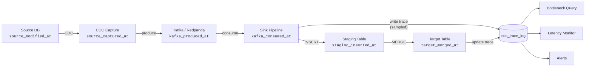

# CDC Event Tracing — End-to-End Latency Monitoring

> **Status:** Design phase — not yet implemented.
> **Last updated:** February 2026

---

## Table of Contents

- [Overview](#overview)
- [The Problem](#the-problem)
- [Solution: Embedded Trace Timestamps](#solution-embedded-trace-timestamps)
- [Trace Stages](#trace-stages)
- [Event Envelope Structure](#event-envelope-structure)
- [Implementation](#implementation)
  - [Source Pipeline — Stamp Origin](#source-pipeline--stamp-origin)
  - [Sink Pipeline — Stamp Delivery](#sink-pipeline--stamp-delivery)
  - [Trace Log Table](#trace-log-table)
  - [Writing the Trace Record](#writing-the-trace-record)
- [Sampling Strategy](#sampling-strategy)
  - [Permanent Sampling (≤ 5%)](#permanent-sampling--5)
  - [Full Tracing (100%) — Debug Mode](#full-tracing-100--debug-mode)
  - [Sampling Implementation](#sampling-implementation)
- [Bottleneck Detection Queries](#bottleneck-detection-queries)
  - [Stage-by-Stage Bottleneck Analysis](#stage-by-stage-bottleneck-analysis)
  - [Real-Time Latency Percentiles](#real-time-latency-percentiles)
  - [Threshold Alerting](#threshold-alerting)
- [Performance Impact & Mitigations](#performance-impact--mitigations)
  - [Per-Event Overhead](#per-event-overhead)
  - [Overhead by Sampling Rate](#overhead-by-sampling-rate)
  - [Mitigations](#mitigations)
- [Architecture Diagram](#architecture-diagram)
- [Operational Runbook](#operational-runbook)
- [References](#references)

---

## Overview

End-to-end event tracing (lineage tracing) embeds timestamps at each processing stage into the CDC event envelope. By comparing these timestamps, you can pinpoint exactly **where time is spent** in the pipeline — from the moment a row is modified in the source database to the moment it lands in the target table.

This gives visibility into:
- Which stage is the bottleneck (capture? Kafka? sink? merge?)
- How latency varies by table, time of day, or event volume
- Whether SLO thresholds are being met
- Where to focus optimization efforts

---

## The Problem

Without tracing, when a CDC pipeline is slow you only know the **total lag** (source commit → target visible). You cannot tell:

- Is the CDC connector slow to read changes?
- Is Kafka produce/consume adding latency?
- Is the sink INSERT/COPY slow?
- Is the MERGE/upsert the bottleneck?

You end up guessing, or instrumenting one stage at a time — slow and error-prone.

---

## Solution: Embedded Trace Timestamps

Each CDC event carries a `_trace` metadata object that **accumulates timestamps** as it flows through stages. The `_trace` data travels with the event through Kafka, so no external correlation service is needed.

At the end of the pipeline, a sampled subset of trace records are written to a `cdc_trace_log` table for analysis.

---

## Trace Stages

```
┌─────────────┐   ┌─────────────┐   ┌──────────┐   ┌──────────┐   ┌─────────┐   ┌──────────┐
│ Source DB    │──▶│ CDC Capture │──▶│ Kafka    │──▶│ Kafka    │──▶│ Staging │──▶│ Target   │
│ COMMIT       │   │ Read        │   │ Produce  │   │ Consume  │   │ INSERT  │   │ MERGE    │
│              │   │             │   │          │   │          │   │         │   │          │
│ modified_at  │   │ captured_at │   │ kafka_   │   │ kafka_   │   │ staging │   │ target_  │
│              │   │             │   │ produced │   │ consumed │   │ inserted│   │ merged   │
└─────────────┘   └─────────────┘   └──────────┘   └──────────┘   └─────────┘   └──────────┘
```

| # | Stage | Timestamp Field | What It Measures |
|---|-------|----------------|------------------|
| 1 | Source DB commit | `source_modified_at` | When the row was changed in the source database |
| 2 | CDC connector reads change | `source_captured_at` | How fast the connector picks up changes |
| 3 | Published to Kafka topic | `kafka_produced_at` | Serialization + network to broker |
| 4 | Consumed from Kafka topic | `kafka_consumed_at` | Consumer lag + deserialization |
| 5 | Inserted into staging table | `staging_inserted_at` | Staging write latency |
| 6 | Merged into target table | `target_merged_at` | MERGE/upsert execution time |

> **Note:** In Redpanda Connect's architecture, there is no separate buffering layer between the Kafka consumer and the first pipeline processor. The `kafka_consumed_at` timestamp effectively marks both "consumed from Kafka" and "sink processing started". If a future architecture introduces a routing/dispatch layer between Kafka and the sink (e.g., Bytewax), a separate `sink_received_at` timestamp could be added at that point.

---

## Event Envelope Structure

Every CDC event carries this trace metadata:

```json
{
  "operation": "insert",
  "table": "public.customers",
  "primary_key": { "id": 42 },
  "after": { "id": 42, "name": "Alice" },
  "_trace": {
    "trace_id": "evt-20260213-customers-42-a1b2c3d4",
    "source_modified_at": "2026-02-13T10:00:00.123Z",
    "source_captured_at": "2026-02-13T10:00:00.456Z",
    "kafka_produced_at":  "2026-02-13T10:00:00.489Z",
    "kafka_consumed_at":  null,
    "staging_inserted_at": null,
    "target_merged_at":   null,
    "trace_enabled": true
  }
}
```

**Key points:**
- `_trace` is added at the source pipeline; downstream stages fill in their timestamps.
- `trace_enabled` controls whether this event's trace is written to the log table.
- `trace_id` is a human-readable unique identifier for correlation.
- `null` fields are filled by later stages — never removed.

---

## Implementation

### Source Pipeline — Stamp Origin

In the source pipeline Bloblang processors, stamp the origin timestamps and generate the trace envelope:

```yaml
# Source pipeline — after CDC read, before Kafka produce
pipeline:
  processors:
    - bloblang: |
        root = this

        # Trace: stamp source timing
        root._trace.source_modified_at = this.ts_ms.format_timestamp("2006-01-02T15:04:05.000Z")
        root._trace.source_captured_at = now()
        root._trace.trace_id = "evt-%s-%s-%s-%s".format(
          now().format_timestamp("20060102"),
          this.source.table,
          this.after.id,
          uuid_v4().slice(0, 8)
        )

        # Sampling: enable tracing for N% of events
        root._trace.trace_enabled = random_int(min: 1, max: 100) <= 5

  output:
    kafka:
      # ...existing Kafka output config...
      processors:
        - bloblang: |
            root = this
            root._trace.kafka_produced_at = now()
```

### Sink Pipeline — Stamp Delivery

In the sink pipeline, stamp the consumption and write timestamps:

```yaml
# Sink pipeline — after Kafka consume, before staging write
input:
  kafka:
    # ...existing Kafka input config...

pipeline:
  processors:
    # Trace: stamp consumption time
    - bloblang: |
        root = this
        root._trace.kafka_consumed_at = now()

    # ...existing column mapping / transforms...

    # Trace: stamp staging write (just before INSERT)
    - bloblang: |
        root = this
        root._trace.staging_inserted_at = now()
```

The `target_merged_at` timestamp is stamped after the MERGE SQL executes, either:
- By a post-merge processor in the pipeline, or
- By a trigger/function on the trace log update.

### Trace Log Table

```sql
CREATE UNLOGGED TABLE cdc_trace_log (
    trace_id              TEXT PRIMARY KEY,
    table_name            TEXT NOT NULL,
    primary_key           JSONB NOT NULL,
    operation             TEXT NOT NULL,

    -- Stage timestamps
    source_modified_at    TIMESTAMPTZ,
    source_captured_at    TIMESTAMPTZ,
    kafka_produced_at     TIMESTAMPTZ,
    kafka_consumed_at     TIMESTAMPTZ,
    staging_inserted_at   TIMESTAMPTZ,
    target_merged_at      TIMESTAMPTZ,

    -- Computed latencies (milliseconds)
    lag_capture_ms        DOUBLE PRECISION GENERATED ALWAYS AS (
        EXTRACT(EPOCH FROM (source_captured_at - source_modified_at)) * 1000
    ) STORED,
    lag_kafka_produce_ms  DOUBLE PRECISION GENERATED ALWAYS AS (
        EXTRACT(EPOCH FROM (kafka_produced_at - source_captured_at)) * 1000
    ) STORED,
    lag_kafka_consume_ms  DOUBLE PRECISION GENERATED ALWAYS AS (
        EXTRACT(EPOCH FROM (kafka_consumed_at - kafka_produced_at)) * 1000
    ) STORED,
    lag_sink_write_ms     DOUBLE PRECISION GENERATED ALWAYS AS (
        EXTRACT(EPOCH FROM (staging_inserted_at - kafka_consumed_at)) * 1000
    ) STORED,
    lag_merge_ms          DOUBLE PRECISION GENERATED ALWAYS AS (
        EXTRACT(EPOCH FROM (target_merged_at - staging_inserted_at)) * 1000
    ) STORED,
    lag_total_ms          DOUBLE PRECISION GENERATED ALWAYS AS (
        EXTRACT(EPOCH FROM (target_merged_at - source_modified_at)) * 1000
    ) STORED,

    created_at            TIMESTAMPTZ DEFAULT now()
);

-- Indexes for common query patterns
CREATE INDEX idx_trace_table    ON cdc_trace_log(table_name);
CREATE INDEX idx_trace_created  ON cdc_trace_log(created_at);
CREATE INDEX idx_trace_lag      ON cdc_trace_log(lag_total_ms);
```

**Why UNLOGGED?**
- Trace data is diagnostic, not business-critical.
- UNLOGGED tables skip WAL writes → ~2× faster INSERTs.
- Data is lost on crash — acceptable for monitoring data.

### Writing the Trace Record

In the sink pipeline, conditionally insert into the trace log:

```yaml
# After staging insert, if tracing is enabled for this event
pipeline:
  processors:
    - bloblang: |
        # Only write trace if sampling flag is set
        if this._trace.trace_enabled == true {
          root = this
        } else {
          root = deleted()
        }

  output:
    switch:
      cases:
        - check: this._trace.trace_enabled == true
          output:
            sql_insert:
              driver: postgres
              dsn: "${TARGET_DSN}"
              table: cdc_trace_log
              columns:
                - trace_id
                - table_name
                - primary_key
                - operation
                - source_modified_at
                - source_captured_at
                - kafka_produced_at
                - kafka_consumed_at
                - staging_inserted_at
              args_mapping: |
                root = [
                  this._trace.trace_id,
                  this.table,
                  this.primary_key.string(),
                  this.operation,
                  this._trace.source_modified_at,
                  this._trace.source_captured_at,
                  this._trace.kafka_produced_at,
                  this._trace.kafka_consumed_at,
                  this._trace.staging_inserted_at
                ]
```

---

## Sampling Strategy

### Permanent Sampling (≤ 5%)

**Always-on** sampling at a low rate for continuous visibility:

| Rate | Use Case | Storage/day (at 10K events/min) |
|------|----------|--------------------------------|
| 1% | Low-volume baseline monitoring | ~1.2 MB |
| 3% | Standard production monitoring | ~3.6 MB |
| 5% | Detailed monitoring, early warning | ~6 MB |

**Benefits:**
- Continuous bottleneck visibility without manual intervention
- Statistically representative of pipeline behavior
- Negligible performance impact (< 1% throughput reduction)
- Catches gradual latency drift before it becomes a problem

**Recommendation:** Start with **3%** and adjust based on event volume.

### Full Tracing (100%) — Debug Mode

Enable **temporarily** when an issue is observed:

```yaml
# Override sampling rate via environment variable
root._trace.trace_enabled = random_int(min: 1, max: 100) <= env("CDC_TRACE_SAMPLE_PCT").number()
```

| Scenario | Duration | Action |
|----------|----------|--------|
| Latency spike observed | 5-15 minutes | Set `CDC_TRACE_SAMPLE_PCT=100`, analyze, revert |
| New table onboarded | 1-2 hours | Verify end-to-end latency for the new table |
| Post-deployment check | 30 minutes | Confirm no regression after pipeline changes |
| Performance profiling | 1 hour | Measure baseline for capacity planning |

**Important:** Always revert to permanent sampling rate after debugging.

### Sampling Implementation

```yaml
# In source pipeline Bloblang — configurable via environment variable
# Default to 3% if not set
let sample_pct = env("CDC_TRACE_SAMPLE_PCT").or("3").number()
root._trace.trace_enabled = random_int(min: 1, max: 100) <= $sample_pct
```

To enable 100% tracing temporarily:

```bash
# Set environment variable and restart pipeline
export CDC_TRACE_SAMPLE_PCT=100

# After investigation, revert
export CDC_TRACE_SAMPLE_PCT=3
```

---

## Bottleneck Detection Queries

### Stage-by-Stage Bottleneck Analysis

```sql
-- Which stage is the bottleneck? (last 1 hour)
SELECT
    table_name,
    COUNT(*)                                            AS events,
    ROUND(AVG(lag_capture_ms)::numeric, 1)              AS avg_capture_ms,
    ROUND(AVG(lag_kafka_produce_ms)::numeric, 1)        AS avg_kafka_prod_ms,
    ROUND(AVG(lag_kafka_consume_ms)::numeric, 1)        AS avg_kafka_cons_ms,
    ROUND(AVG(lag_sink_write_ms)::numeric, 1)           AS avg_sink_ms,
    ROUND(AVG(lag_merge_ms)::numeric, 1)                AS avg_merge_ms,
    ROUND(AVG(lag_total_ms)::numeric, 1)                AS avg_total_ms,
    CASE GREATEST(
        AVG(lag_capture_ms),
        AVG(lag_kafka_produce_ms),
        AVG(lag_kafka_consume_ms),
        AVG(lag_sink_write_ms),
        AVG(lag_merge_ms)
    )
        WHEN AVG(lag_capture_ms)       THEN '🔴 CDC capture'
        WHEN AVG(lag_kafka_produce_ms) THEN '🔴 Kafka produce'
        WHEN AVG(lag_kafka_consume_ms) THEN '🔴 Kafka consume'
        WHEN AVG(lag_sink_write_ms)    THEN '🔴 Sink write'
        WHEN AVG(lag_merge_ms)         THEN '🔴 Target merge'
    END AS bottleneck
FROM cdc_trace_log
WHERE created_at > now() - INTERVAL '1 hour'
GROUP BY table_name
ORDER BY avg_total_ms DESC;
```

### Real-Time Latency Percentiles

```sql
-- p50 / p95 / p99 latency per table (last 5 minutes)
SELECT
    table_name,
    COUNT(*)                                                                        AS events,
    ROUND(PERCENTILE_CONT(0.50) WITHIN GROUP (ORDER BY lag_total_ms)::numeric, 1)   AS p50_ms,
    ROUND(PERCENTILE_CONT(0.95) WITHIN GROUP (ORDER BY lag_total_ms)::numeric, 1)   AS p95_ms,
    ROUND(PERCENTILE_CONT(0.99) WITHIN GROUP (ORDER BY lag_total_ms)::numeric, 1)   AS p99_ms,
    ROUND(MAX(lag_total_ms)::numeric, 1)                                            AS max_ms
FROM cdc_trace_log
WHERE created_at > now() - INTERVAL '5 minutes'
GROUP BY table_name
ORDER BY p95_ms DESC;
```

### Threshold Alerting

```sql
-- Events exceeding SLO thresholds (last 10 minutes)
SELECT
    trace_id,
    table_name,
    operation,
    ROUND(lag_total_ms::numeric, 0) AS total_ms,
    CASE
        WHEN lag_capture_ms > 1000       THEN '⚠️  CDC capture > 1s'
        WHEN lag_kafka_produce_ms > 500  THEN '⚠️  Kafka produce > 500ms'
        WHEN lag_kafka_consume_ms > 2000 THEN '⚠️  Kafka consume > 2s'
        WHEN lag_sink_write_ms > 5000    THEN '⚠️  Sink write > 5s'
        WHEN lag_merge_ms > 3000         THEN '⚠️  Target merge > 3s'
        WHEN lag_total_ms > 10000        THEN '⚠️  Total > 10s'
    END AS alert
FROM cdc_trace_log
WHERE created_at > now() - INTERVAL '10 minutes'
  AND lag_total_ms > 5000
ORDER BY lag_total_ms DESC;
```

---

## Performance Impact & Mitigations

### Per-Event Overhead

| Component | Cost | Impact |
|-----------|------|--------|
| Timestamp assignments (Bloblang `now()`) | ~1-5 μs per call, 2-3 calls per event | Negligible |
| Trace ID generation (`uuid_v4()`) | ~1-2 μs per event | Negligible |
| Payload size increase | ~200-400 bytes per event | ~5-15% larger messages |
| Kafka topic storage | Extra bytes × retention period | Marginal |
| Trace log INSERT | 1 extra INSERT per traced event | **Main cost — mitigated by sampling** |

### Overhead by Sampling Rate

At **10,000 events/minute** (~170 events/sec):

| Sampling Rate | Extra writes/min | Storage/day | Throughput Impact |
|---------------|-----------------|-------------|-------------------|
| 1% | 100 | ~1.2 MB | < 0.5% |
| 3% | 300 | ~3.6 MB | < 0.5% |
| 5% | 500 | ~6 MB | < 1% |
| 100% (debug) | 10,000 | ~120 MB | ~3-5% |

### Mitigations

| Concern | Mitigation |
|---------|------------|
| **Trace log grows unbounded** | Automated cleanup: delete rows older than 48 hours via `pg_cron` or pipeline scheduler |
| **Trace INSERT slows sink** | Use UNLOGGED table (no WAL); batch trace writes; keep sampling ≤ 5% |
| **Larger Kafka messages** | ~300 bytes added (~5-15%); well within Kafka message size limits |
| **Clock skew between hosts** | Use NTP sync on all hosts; trace latencies are relative (same-host deltas are accurate) |
| **100% tracing in prod** | Only enable for short debug sessions (5-15 min); enforce via alerting on `CDC_TRACE_SAMPLE_PCT` |
| **Trace log query performance** | Time-bound all queries (`WHERE created_at > now() - INTERVAL ...`); indexes on `table_name` and `created_at` |

**Automated cleanup job:**

```sql
-- Run daily via pg_cron or external scheduler
DELETE FROM cdc_trace_log
WHERE created_at < now() - INTERVAL '48 hours';
```

---

## Architecture Diagram



---

## Operational Runbook

### Routine: Check pipeline health

```bash
# Connect to target PostgreSQL and run bottleneck query
psql -h $TARGET_HOST -d $TARGET_DB -f queries/bottleneck_analysis.sql
```

### Incident: Latency spike detected

1. **Enable full tracing:** `export CDC_TRACE_SAMPLE_PCT=100` → restart pipeline
2. **Wait 5 minutes** for data to accumulate
3. **Run bottleneck query** to identify slowest stage
4. **Act on bottleneck:**
   - CDC capture slow → check source DB load, CDC table count
   - Kafka slow → check broker load, partition count, consumer group lag
   - Sink write slow → check target DB connections, lock contention, disk I/O
   - Merge slow → check index bloat, table size, dead tuples
5. **Revert sampling:** `export CDC_TRACE_SAMPLE_PCT=3` → restart pipeline

### Maintenance: Clean up trace data

```sql
-- Check trace log size
SELECT pg_size_pretty(pg_total_relation_size('cdc_trace_log'));

-- Purge old data
DELETE FROM cdc_trace_log WHERE created_at < now() - INTERVAL '48 hours';

-- Reclaim space (optional, for UNLOGGED tables)
VACUUM cdc_trace_log;
```

---

## References

- [PostgreSQL GENERATED ALWAYS AS](https://www.postgresql.org/docs/current/ddl-generated-columns.html)
- [PostgreSQL UNLOGGED Tables](https://www.postgresql.org/docs/current/sql-createtable.html#SQL-CREATETABLE-UNLOGGED)
- [Redpanda Connect Bloblang Functions](https://docs.redpanda.com/redpanda-connect/guides/bloblang/functions/)
- [Kafka Consumer Lag Monitoring](https://docs.redpanda.com/current/manage/monitoring/)
- [pg_cron — Job Scheduler](https://github.com/citusdata/pg_cron)
