# Native CDC Runtime — Architecture & Orchestrator Interaction

> Status: Target architecture plus current generated-runtime notes (2026-05-11)
> Applies to: `adopus-cdc-pipeline` (db-per-tenant → `sink_asma.directory`)
> Generated by: `cdc manage-migrations generate --topology fdw`
> Orchestrator: `asma-cdc-orchestrator` (Bun.js)

---

## Overview

The native CDC runtime replaces the Redpanda/Bento broker layer with a **direct PostgreSQL-native pull/merge loop**. The orchestrator polls the `cdc_management` tables inside the target PostgreSQL database (`directory`), claims work items, pulls rows from MSSQL via `tds_fdw` foreign tables, merges them into the final tables, and records the outcome.

No external message broker (Kafka/Redpanda) is required. All scheduling state lives in PostgreSQL tables.

Current compliance note: the latest generated Adopus migration set is not yet deployment-complete. The manifest currently reports `table_count: 0`, native mode still includes legacy `02-cdc-management.sql`, and bootstrap/checkpoint gating needs tightening before rollout. See [Native CDC Runtime Gap Analysis](../../../../_docs/cdc/native-cdc-runtime-gap-analysis.md) for the active closure plan.

---

## Architecture Diagram

```mermaid
flowchart TB
    subgraph MSSQL["MSSQL Source (AdOpus)"]
        CT["cdc.dbo_Actor_CT<br/>cdc.dbo_Soknad_CT<br/>...<br/>(CDC change tables)"]
    end

    subgraph PG["PostgreSQL — directory (sink_asma.directory)"]
        subgraph FDW["tds_fdw Layer"]
            FT["fdw_{env}_{customer}.dbo_Actor_CT<br/>(foreign tables to MSSQL CDC)"]
        end

        subgraph STG["Staging Layer"]
            STGT["adopus.stg_Actor<br/>adopus.stg_Soknad<br/>(staging tables, UNLOGGED)"]
        end

        subgraph FINAL["Final Tables"]
            FTBL["adopus.Actor<br/>adopus.Soknad<br/>(target tables with customer_id)"]
        end

        subgraph MGMT["cdc_management Schema"]
            REG["source_table_registration<br/>(tracked tables)"]
            POL["native_cdc_schedule_policy<br/>(polling config per table)"]
            TIER["native_cdc_tier_assignment<br/>(auto-tier evaluation)"]
            RT["native_cdc_runtime_state<br/>(live runtime, UNLOGGED)"]
            ACT["native_cdc_activity_rollup_hourly<br/>(hourly aggregates)"]
            CKPT["native_cdc_checkpoint<br/>(LSN tracking)"]
            BOOT["native_cdc_bootstrap_state<br/>(snapshot load tracking)"]
            META["customer_registry<br/>environment_profile<br/>source_instance<br/>(FDW metadata)"]
        end

        subgraph FUNC["Generated Per-Table Functions"]
            PULL["adopus.pull_actor_batch()<br/>adopus.pull_soknad_batch()"]
            MERGE["adopus.sp_merge_actor()<br/>adopus.sp_merge_soknad()"]
            BOOTF["adopus.bootstrap_actor_snapshot()<br/>adopus.bootstrap_soknad_snapshot()"]
        end
    end

    subgraph ORCH["asma-cdc-orchestrator (Bun.js)"]
        SCHED["Scheduler<br/>(main loop)"]
        CLAIM["claimWork.ts<br/>→ claim_due_native_cdc_work()"]
        PULLH["pullBatch.ts<br/>→ pull_<table>_batch()"]
        MERGEH["mergeBatch.ts<br/>→ sp_merge_<table>()"]
        BOOK["bookkeeping.ts<br/>→ mark_success / mark_failure / renew_lease"]
        ADJ["adjustInterval.ts<br/>→ reads runtime_state + policy"]
        REC["recordActivity.ts<br/>→ writes activity_rollup"]
        EVAL["TierEvaluator<br/>(promote/demote)"]
    end

    %% Flow arrows
    REG -->|"trigger: sync_native_cdc_registration_state()"| POL
    REG -->|"trigger: sync_native_cdc_registration_state()"| RT
    REG -->|"trigger: sync_native_cdc_registration_state()"| TIER
    POL -->|"resolve_native_cdc_schedule_policy()"| POL

    SCHED -->|"1. claim work"| CLAIM
    CLAIM -->|"SELECT ... FOR UPDATE SKIP LOCKED"| RT
    CLAIM -->|"reads"| POL
    RT -->|"returns due items"| CLAIM

    SCHED -->|"2. pull batch"| PULLH
    PULLH -->|"calls pull_<table>_batch()"| PULL
    PULL -->|"INSERT INTO stg_<table>"| STGT
    PULL -->|"reads from"| FT
    FT -.->|"tds_fdw"| CT

    SCHED -->|"3. merge batch"| MERGEH
    MERGEH -->|"calls sp_merge_<table>()"| MERGE
    MERGE -->|"UPSERT / DELETE"| FTBL
    MERGE -->|"TRUNCATE"| STGT

    SCHED -->|"4. bookkeeping"| BOOK
    BOOK -->|"mark_success / mark_failure"| RT
    BOOK -->|"renew_lease"| RT

    SCHED -->|"5. record activity"| REC
    REC -->|"INSERT hourly rollup"| ACT

    SCHED -->|"6. adjust interval"| ADJ
    ADJ -->|"reads"| RT
    ADJ -->|"reads"| POL
    ADJ -->|"writes new interval"| RT

    EVAL -->|"periodic: promote/demote"| TIER
    ACT -->|"read 6h/7d windows"| EVAL
```



---

## Tables Reference

### Metadata (FDW Bootstrap)

These are populated by `cdc fdw sql --service adopus`:

| Table | Primary Key | Purpose |
|-------|-------------|---------|
| `customer_registry` | `customer_key` | Maps source customer name → UUID |
| `environment_profile` | `environment_name` | MSSQL connection details per environment |
| `source_instance` | `source_instance_key` | One row per (customer × env) — links to FDW server/schema |
| `source_table_registration` | `(source_instance_key, logical_table_name)` | Tracked tables, their remote CDC table and target names |

### Runtime Scheduling & State

Generated by `cdc manage-migrations generate --topology fdw`:

| Table | Type | Purpose |
|-------|------|---------|
| `native_cdc_schedule_policy` | Regular | Per-table polling config: profile, intervals, batch sizes, priorities |
| `native_cdc_tier_assignment` | Regular | Auto-tier state: current effective tier, evaluation timestamps |
| `native_cdc_runtime_state` | **UNLOGGED** | Live per-table state: current interval, lease, streaks, counters |
| `native_cdc_activity_rollup_hourly` | Regular | Hourly aggregates of pull activity for tier evaluation |
| `native_cdc_checkpoint` | Regular | LSN tracking per `(customer_id, table_name)` |
| `native_cdc_bootstrap_state` | Regular | Initial snapshot load lifecycle: pending → in_progress → completed/failed |

### Tier Presets (Orchestrator Hardcoded)

| Profile | Hop Ladder (seconds) | Max Rows/Pull | Lease | Jitter | Max Backoff |
|---------|---------------------|---------------|-------|--------|-------------|
| `hot`   | 1, 5, 30            | 2000          | 120s  | 0ms    | 60s         |
| `warm`  | 5, 15, 30, 60       | 1000          | 120s  | 250ms  | 300s        |
| `cool`  | 30, 60, 120, 300    | 750           | 120s  | 1000ms | 300s        |
| `cold`  | 60, 300, 900, 1800  | 500           | 180s  | 5000ms | 900s        |

---

## Functions & Procedures Reference

### Infrastructure Functions (in `03-native-cdc-runtime.sql`)

| Function | Signature | Called By | Purpose |
|----------|-----------|-----------|---------|
| `resolve_native_cdc_schedule_policy` | `(source_instance_key, logical_table_name) → policy row` | `sync_...`, `claim_...` | Reads `native_cdc_schedule_policy`; falls back to warm defaults if no row exists |
| `sync_native_cdc_registration_state` | `(source_instance_key, logical_table_name) → void` | Trigger, bootstrap | Populates `schedule_policy`, `runtime_state`, `tier_assignment`, `bootstrap_state` from registration |
| `trg_sync_native_cdc_registration_state` | Trigger on `source_table_registration` | PostgreSQL | Fires on INSERT/UPDATE to auto-sync downstream tables |
| `claim_due_native_cdc_work` | `(limit, lease_seconds, worker) → work items` | Orchestrator | Claims due work with `FOR UPDATE SKIP LOCKED` for multi-replica safety |
| `bootstrap_native_cdc_tables` | `(source_instance_key, table_names, enable_after) → results` | Admin / CLI | Manages initial snapshot load lifecycle |
| `renew_native_cdc_lease` | `(source_instance_key, logical_table_name, worker, lease_seconds) → void` | Orchestrator | Extends lease during long-running pulls |
| `mark_native_cdc_success` | `(source_instance_key, logical_table_name, rows, duration_ms) → void` | Orchestrator | Records success: resets failure streak, advances next_pull_at with jitter |
| `mark_native_cdc_failure` | `(source_instance_key, logical_table_name, error, retry_seconds) → void` | Orchestrator | Records failure: backoff, increments failure counter |

### Views

| View | Purpose |
|------|---------|
| `v_native_cdc_schedule` | Unified view joining all 6 runtime tables — used for dashboards and debugging |
| `v_native_cdc_health` | Health-focused view adding `overdue_seconds`, `checkpoint_updated_at`, bootstrap status |

### Per-Table Generated Functions (in `01-tables/<Table>.sql` and `<Table>-staging.sql`)

| Function Pattern | Location | Purpose |
|-----------------|----------|---------|
| `{schema}.pull_{table}_batch()` | staging SQL | Pulls rows from FDW foreign table → staging, records LSN checkpoint |
| `{schema}.sp_merge_{table}()` | staging SQL | Merges staging → final table (UPSERT/DELETE), truncates staging |
| `{schema}.bootstrap_{table}_snapshot()` | staging SQL | Initial full-table snapshot from MSSQL base table via FDW |

---

## Orchestrator Interaction Flow

### Per-Cycle Sequence (for each claimed work item)

```text
┌─────────────────────────────────────────────────────────┐
│                   ORCHESTRATOR CYCLE                     │
│                                                         │
│  1. CLAIM                                               │
│     claimWork(db, limit, workerId)                      │
│       → SELECT FROM claim_due_native_cdc_work(limit,    │
│             lease_seconds, worker)                      │
│       → FOR UPDATE SKIP LOCKED on runtime_state         │
│       → Returns: sourceInstanceKey, logicalTableName,   │
│                  targetSchemaName, targetTableName,     │
│                  effectiveScheduleProfile,              │
│                  currentPollInterval, maxRowsPerPull,   │
│                  leaseSeconds, pollPriority              │
│                                                         │
│  2. PULL                                                │
│     pullBatch(db, workItem, logger)                     │
│       → SELECT FROM {schema}.pull_{table}_batch(        │
│             sourceInstanceKey, maxRowsPerPull)          │
│       → INSERT INTO {schema}.stg_{table}                │
│         FROM fdw_{env}_{customer}.cdc_{schema}_{table}_CT│
│         WHERE __$start_lsn > last_checkpoint_lsn        │
│       → Returns: batchId, rowsInserted                  │
│                                                         │
│  3. MERGE                                               │
│     mergeBatch(db, workItem, logger)                    │
│       → CALL {schema}.sp_merge_{table}(batchId)         │
│       → UPSERT final table from staging                 │
│       → DELETE final rows for CDC operation=1           │
│       → TRUNCATE staging                                │
│       → Returns: rowsMerged, durationMs                 │
│                                                         │
│  4. BOOKKEEPING                                         │
│     markSuccess(db, workItem, result)                   │
│       → CALL mark_native_cdc_success(                   │
│             sourceKey, tableName, rowsMerged,           │
│             durationMs)                                 │
│       → Updates runtime_state:                          │
│         - last_success_at = NOW()                       │
│         - empty_pull_streak = 0 or +1                   │
│         - next_pull_at = NOW() + interval + jitter      │
│         - consecutive_failures = 0                      │
│         - lease_owner/expires = NULL                    │
│                                                         │
│     — OR on failure —                                   │
│     markFailure(db, workItem, error)                    │
│       → CALL mark_native_cdc_failure(                   │
│             sourceKey, tableName, errorMsg,             │
│             retrySeconds)                               │
│       → Updates runtime_state:                          │
│         - next_pull_at = NOW() + backoff + jitter       │
│         - consecutive_failures += 1                     │
│         - last_error = errorMsg                         │
│                                                         │
│  5. RECORD ACTIVITY                                     │
│     recordActivity(activityRollup, workItem,            │
│                    result, error)                       │
│       → INSERT INTO native_cdc_activity_rollup_hourly   │
│         ON CONFLICT UPDATE counters                     │
│       → Uses hourly bucket start for aggregation        │
│                                                         │
│  6. ADJUST INTERVAL                                     │
│     adjustInterval(db, workItem, result, error)         │
│       → SELECT current_poll_interval, empty_streak,     │
│                consecutive_failures FROM runtime_state  │
│       → Apply tier hop ladder (TierManager)             │
│       → UPDATE runtime_state SET current_interval,      │
│                next_pull_at                             │
│                                                         │
└─────────────────────────────────────────────────────────┘
```

### Configuration Bootstrap (one-time / on registration change)

```text
source_table_registration INSERT/UPDATE
        │
        ▼
  trg_sync_native_cdc_registration_state (AFTER INSERT OR UPDATE)
        │
        ▼
  sync_native_cdc_registration_state(source_instance_key, logical_table_name)
        │
        ├─► resolve_native_cdc_schedule_policy()
        │     → reads native_cdc_schedule_policy (or warm defaults)
        │
        ├─► INSERT/UPDATE native_cdc_schedule_policy
        │
        ├─► INSERT/UPDATE native_cdc_runtime_state
        │     (initial checkpoint_table_name, current_poll_interval, next_pull_at=NOW())
        │
        ├─► INSERT/UPDATE native_cdc_tier_assignment
        │     (effective_schedule_profile, reason='initial baseline tier')
        │
        └─► INSERT native_cdc_bootstrap_state
              (status='completed' if enabled, else 'pending')
```

### Tier Evaluation (periodic, every 6h promotion / 7d demotion)

```text
TierEvaluator.evaluate(sourceInstanceKey, logicalTableName, ...)
        │
        ├─► Reads native_cdc_activity_rollup_hourly (last 6h for promotion, 7d for demotion)
        ├─► Reads native_cdc_tier_assignment (current effective tier, last_evaluated_at)
        │
        ├─► Promotion rules:
        │     - Current = warm, >80% nonempty pulls in 6h → promote to hot
        │     - Current = cool, >50% nonempty pulls in 6h → promote to warm
        │     - Current = cold, >30% nonempty pulls in 6h → promote to cool
        │
        ├─► Demotion rules:
        │     - Current = hot, <10% nonempty pulls in 7d → demote to warm
        │     - Current = warm, <5% nonempty pulls in 7d → demote to cool
        │     - Current = cool, no nonempty pulls in 7d → demote to cold
        │
        └─► UPDATE native_cdc_tier_assignment
              (effective_schedule_profile, previous_schedule_profile,
               change_reason, last_evaluated_at, last_promoted_at / last_demoted_at)
```

---

## Concurrency & Lease Safety

The `claim_due_native_cdc_work()` function uses PostgreSQL row-level locking to ensure safe concurrent access across multiple orchestrator replicas:

1. **`FOR UPDATE OF runtime SKIP LOCKED`** — each replica claims different rows
2. **Lease column** (`lease_owner`, `lease_expires_at`) — prevents double-claiming:
   - Only rows with `lease_expires_at IS NULL OR lease_expires_at <= NOW()` are eligible
   - Claim sets `lease_owner` and `lease_expires_at = NOW() + lease_seconds`
3. **`renew_native_cdc_lease()`** — called periodically during long-running pulls to extend the lease
4. **Expired leases** — automatically become eligible again, preventing stuck work items

---

## Environment Mapping

The `source_table_registration` table does not directly carry an environment column. Instead:

```text
source_instance_key → source_instance → environment_name → environment_profile
```

The environment is derived through the source instance chain. The `source_instance_key` is constructed as `{source_env}_{customer_key}` by `cdc fdw sql`.

The `directory` PostgreSQL database is environment-aware: `directory_dev`, `directory_stage`, `directory_test`, `directory_prod`. Each environment hosts its own set of `cdc_management` tables, and the orchestrator connects to the appropriate database per environment.

---

## Key Design Decisions

1. **UNLOGGED `runtime_state`** — no WAL overhead for high-frequency polling state; acceptable to lose on crash (re-syncs from policy defaults)
2. **`native_cdc_schedule_policy` is the source of truth** — `resolve_native_cdc_schedule_policy()` queries it directly (not hardcoded VALUES)
3. **Trigger-driven bootstrapping** — inserting a row into `source_table_registration` auto-populates all downstream tables
4. **Separate checkpoint table** — LSN tracking keyed by `customer_id` (not `source_instance_key`) so re-registrations reuse the same checkpoint
5. **Tier evaluation on separate cadences** — promotion (6h) is faster than demotion (7d) to avoid flapping
6. **Jitter on every `next_pull_at`** — prevents thundering herd when many tables share the same interval
