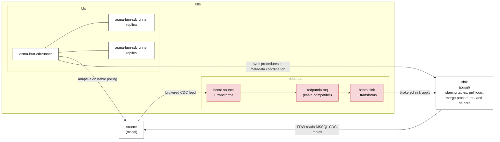

# CDC Topology And Runtime Composition

> Status: Proposed simplification for the next naming pass
> Last updated: 2026-03-28

---

## Executive Decision

The architecture should be modeled as a hierarchy, not as a combinatorial matrix of mostly-invalid axes.

The proposed user-facing model is:

1. `pattern` is always relevant
2. `source type` is chosen next
3. `topology` is chosen from the valid options for that source type

That gives a simpler decision tree:

```text
pattern
  -> source type
     -> topology
```

The target document model is therefore:

- keep `pattern` as the first-class axis
- keep source type as the second axis
- simplify topology names to `redpanda`, `fdw`, and `pg_native`
- stop treating `runtime_engine` as a first-class architecture axis
- stop treating `broker_topology` as a first-class architecture axis

This document describes the proposed target model for the next cleanup pass. It does not claim that the current code is already fully aligned with this simplification.

---

## Proposed Hierarchy

### 1. Pattern

`pattern` remains the first and always-relevant dimension:

- `db-per-tenant`
- `db-shared`

This describes tenancy and grouping shape, not transport.

### 2. Source Type

Source type is the next discriminator.

Current config still uses `type` with values such as:

- `mssql`
- `postgres`

The important design point is not the field name. The important point is that topology is chosen only after source type is known.

### 3. Topology

Topology should be modeled as the valid transport and materialization family for the selected source type.

Proposed topology names:

- `redpanda`
- `fdw`
- `pg_native`

Valid hierarchy:

```text
pattern: always relevant

source type: mssql
  topology:
    - redpanda
    - fdw

source type: postgres
  topology:
    - redpanda
    - pg_native
```

This is intentionally not a free cross-product. Most combinations do not make sense, so the model should stop pretending that they do.

---

## Current Runtime Diagram

This is the current runtime-oriented view of how source changes reach the sink-side PostgreSQL logic. The naming cleanup proposed in this document should simplify the public model, but it does not change these basic data paths.



Notes:

- Brokered path: MSSQL changes flow through Bento and Redpanda before reaching the PostgreSQL sink.
- FDW path: the PostgreSQL sink and `asma-bun-cdcrunner` pull directly from MSSQL CDC tables and execute sink-side sync and merge logic.
- In both paths, the sink-side PostgreSQL layer is where generated tables, staging objects, procedures, and operational helpers live.

---

## Naming Direction

### Keep

- `pattern`
- source type as the next branch in the decision tree

### Rename Toward

- `redpanda` instead of `brokered_redpanda`
- `fdw` instead of `mssql_fdw_pull`
- `pg_native` instead of `pg_logical`

### Why These Shorter Names Are Better

They are easier to reason about operationally:

- `redpanda` clearly means the brokered path we actually run here
- `fdw` is already enough context when the source is MSSQL and the sink side is PostgreSQL
- `pg_native` is a better user-facing label than `pg_logical` because the intended meaning is the PostgreSQL-native path, not only the low-level replication mechanism

`pg_native` can still be implemented with logical replication under the hood. The point here is naming the architecture path, not naming a single internal primitive.

---

## Why `runtime_engine` Should Not Be A Primary Axis

`runtime_engine` does not behave like an independent architecture choice.

For the current and planned design:

- `redpanda` uses Bento for the transport path today
- `fdw` uses Bun-based orchestration for pull and apply work
- `pg_native` is the PostgreSQL-native path

That alone already makes `runtime_engine` weak as a top-level axis, but the stronger reason is this:

- Bun-based apply orchestration can exist in both `redpanda` and `fdw`
- the same runtime component can support multiple topologies
- one topology can involve more than one runtime concern

So `runtime_engine` is not a clean discriminator. It mixes transport execution, orchestration, and apply mechanics into one misleading field.

For documentation purposes, it is better to treat runtime pieces as implementation details owned by each topology, not as a universal architecture axis.

---

## Why `broker_topology` Should Not Be A Primary Axis

`broker_topology` is only relevant for the `redpanda` topology.

Even there, the current design does not need a general-purpose architecture field for it. The practical rule is simpler:

- if topology is `redpanda`, broker shape is shared at the source-group level
- if topology is not `redpanda`, broker shape is irrelevant

That means `broker_topology` should not be treated as one of the core architecture dimensions.

If later the `redpanda` path genuinely needs more than one broker layout, that can be modeled as a Redpanda-specific detail under that topology, not as a global cross-topology field.

---

## What Stays Topology-Specific

### `fdw`

FDW-specific logic stays inside the `fdw` topology boundary.

That includes:

- `tds_fdw` bootstrap and foreign tables
- MSSQL CDC retention-gap checks
- `__$start_lsn` and `__$seqval` checkpoint semantics
- pull claiming, lease handling, and merge orchestration for the FDW path

Those mechanics should not be generalized into a universal topology contract.

### `redpanda`

Redpanda-specific logic stays inside the `redpanda` topology boundary.

That includes:

- topic routing
- broker connectivity
- event transport concerns

### `pg_native`

PostgreSQL-native logic stays inside the `pg_native` topology boundary.

That includes:

- publication and subscription management
- PostgreSQL-native replication concerns
- any PostgreSQL-only delivery semantics

---

## Simplified Building Block Matrix

| Building block | `redpanda` | `fdw` | `pg_native` |
|---|---|---|---|
| Source discovery and grouping | Shared | Shared | Shared |
| Service table selection | Shared | Shared | Shared |
| Source schema inspection | Shared | Shared | Shared |
| Final table DDL generation | Shared | Shared | Shared where local tables remain generator-owned |
| Staging plus merge apply | Yes | Yes | Usually no direct staging path |
| Broker topics and routing | Yes | No | No |
| FDW bootstrap and foreign tables | No | Yes | No |
| MSSQL retention-gap checks | No | Yes | No |
| Claim plus lease scheduling | No direct FDW-style claim loop | Yes | No |
| Publication plus subscription management | No | No | Yes |

---

## Practical Guidance

- Document the system as `pattern -> source type -> topology`, not as a flat set of orthogonal axes.
- Prefer `redpanda`, `fdw`, and `pg_native` as the user-facing topology names in future docs and implementation cleanup.
- Treat runtime pieces such as Bento or Bun orchestration as topology-owned implementation details, not as a global architecture field.
- Treat broker shape as a Redpanda-specific detail only if it is ever needed explicitly.
- Keep FDW LSN safety and checkpoint rules isolated to the `fdw` topology.

---

## Derived Runtime Selection

The migration and runtime choice should be derived from topology, not selected as a separate primary concept.

For the proposed model, that means:

- `mssql + redpanda` should derive the brokered migration and runtime layer
- `mssql + fdw` should derive the PostgreSQL-native FDW migration and runtime layer
- `postgres + redpanda` should derive the brokered migration and runtime layer
- `postgres + pg_native` should derive the PostgreSQL-native replication layer

So the intended user-facing contract is:

- pick topology `redpanda`, `fdw`, or `pg_native`
- let the generator select the correct runtime behavior automatically

That is the clean boundary. `runtime_mode` should remain an internal implementation detail if it survives at all.

### Current Implementation Status

Migration generation now exposes a user-facing `--topology redpanda|fdw|pg_native` selector and derives the internal runtime automatically.

Examples:

- `cdc manage-migrations generate --service adopus --topology fdw`
- persist `topology: fdw` in `source-groups.yaml` via `cdc manage-source-groups --set-topology fdw`, then run `cdc manage-migrations generate --service adopus`

That keeps `runtime_mode` internal while still allowing one-off topology overrides from the CLI.

---

## Current Code Versus Target Model

Current code still contains broader internal concepts introduced during the earlier normalization pass, including terms such as `topology_kind`, `runtime_engine`, `runtime_mode`, and `broker_topology`.

The proposal in this document is that the next cleanup pass should simplify the architecture contract rather than expanding those axes further.

So the intended direction is:

- narrower public model
- clearer hierarchy
- fewer architecture fields that look independent but are actually derived or topology-specific

---

## Bottom Line

The model should stop pretending to be combinatorial.

The repository is better described by a simple hierarchy:

- `pattern`
- source type
- topology

And for topology naming, the simpler vocabulary is the better one:

- `redpanda`
- `fdw`
- `pg_native`

That keeps the architecture easier to explain, easier to operate, and easier to cleanly implement in the next pass.
